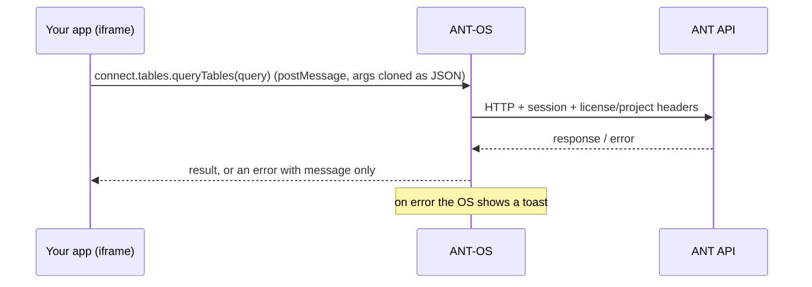

# Calling the ANT API

> **TL;DR** Call `comms.connect.<service>.<method>()` and wrap each call in `useApi()` from
> `@antcde/vue-utils`. The call travels to the OS, which adds the session and makes the request,
> so your app holds no token. `useApi` **does not throw**: check `.error.value`, or pass
> `{ throwError: true }`.
> **Use when** you read or write anything on the platform.

## How a call travels



Consequences, each of which has bitten real apps:

1. **No token in the app.** You never handle credentials, refresh or login. That also means
   you can't call the API with `fetch` yourself; use `connect`.
2. **Arguments are cloned as JSON.** `File`, `Blob`, `FormData`, `Date`, functions and class
   instances don't survive. Send ISO strings for dates. Upload files with presigned URLs
   (see [capabilities/files-dms.md](capabilities/files-dms.md)), not as `FormData`.
3. **Errors arrive as a message only.** `error.response`, `status` and the response body are
   gone by the time they reach your app. Branch on the message if you must, or design
   for "it failed" plus the toast the OS already showed.
4. **The OS shows an error toast for failed calls** (except `409 Conflict`, which is left to
   the app). Don't show a second one.

## Rules

- Always wrap a service call in `useApi`. Never `await connect.x.y()` bare in a component.
- Create **one `useApi` per verb** (list, create, delete…), so loading and error state never mix.
- If two calls of the same verb can overlap (rapid saves), create a fresh `useApi` per call,
  or make the result "latest wins" (see below).
- After `execute()`, check `api.error.value` before treating the result as success, or use
  `{ throwError: true }` and `try/catch`.
- Never use `as` to coerce API results. If the types are wrong, fix the types.
- Use the `connect` from `injectContext()`. Don't build a second client inside the OS.

## `useApi`

```ts
import { useApi } from '@antcde/vue-utils'

const { comms: { connect } } = injectContext()
const listApi = useApi(connect.tables.queryTables<Note>, null)
//                    ^ the service method itself, not a call   ^ initial state

const result = await listApi.execute(query) // resolves to the data, or to `null` on error
if (listApi.error.value)
  return // the OS already showed a toast
```

| Field | Meaning |
| --- | --- |
| `execute(...args)` | Runs the call with the method's own arguments. Resolves to the result |
| `state` | The last result (shallow ref) |
| `isLoading` | `true` while running |
| `error` | The last error, or `undefined` |
| `isReady` | `true` after the first success |
| `executeDelayed(ms, ...args)` | Runs after a delay |

The third argument takes VueUse `useAsyncState` options: `throwError`, `onSuccess`,
`onError`, `resetOnExecute`, `shallow`.

### Does not throw: the most common bug

By default a failed `execute()` **resolves**, to the initial state you passed. Code like this
reports success when the call failed:

```ts
// ❌ a failed save looks like a successful one
await saveApi.execute(payload)
notifications.success(t('saved'))
```

Either check the error:

```ts
await saveApi.execute(payload)
if (!saveApi.error.value)
  notifications.success(t('saved'))
```

…or opt in to throwing. This is required when the caller needs to tell "failed" from "empty",
as with trigger dispatches:

```ts
const dispatchApi = useApi(connect.webhookTriggers.dispatch, null, { throwError: true })
try {
  result.value = await dispatchApi.execute(type, id, triggerId, body)
}
catch (error) {
  failure.value = error instanceof Error ? error.message : String(error)
}
```

### Latest wins

`useApi` does not cancel a running request. When the context can change mid-flight, ignore
stale answers:

```ts
let generation = 0
async function load() {
  const mine = ++generation
  const result = await listApi.execute(query)
  if (mine !== generation)
    return // a newer load started; drop this answer
  rows.value = result?.data ?? []
}
```

### After a mutation

Re-read what changed, or merge the returned entity into local state. If other apps or the
notepad show the same entity, broadcast the change (for tasks:
`signal({ task: { id, action: 'updated', data } })`). See
[signals-and-realtime.md](signals-and-realtime.md).

## Errors

| Situation | What you get | What to do |
| --- | --- | --- |
| API error (4xx/5xx) through `connect` | `api.error.value` set (message only); OS toast shown | Don't toast again. Optionally show inline state |
| Archived project write | Refused by the API | Prevent it: disable writes when `context.projectReadOnly` |
| Network failure outside `connect` (e.g. a storage PUT) | Your own exception | Show your own `notifications.error` |
| A permission you don't have | Refused by the API | Gate the UI with `usePermissions`. See [capabilities/permissions.md](capabilities/permissions.md) |

## Pagination: three conventions

Different endpoints paginate differently. Check the return type.

| Style | Used by | Request | Response |
| --- | --- | --- | --- |
| Paginator | most list endpoints (projects, triggers, DMS lists…) | `page`, `per_page` | `data[]` plus paging info. Some include `total`/`last_page`; others (DMS lists) only `current_page`/`per_page` plus `links`, so use `links.next` to see if there's more. Check the return type |
| Task list | `tasks.getV2Tasks` | `per_page` and `page` in the query string (`buildTaskQuery`) | `{ data, links, meta }`. **Without `per_page` you get everything**, so always set it |
| Table query | `tables.queryTables` | `limit`, `offset` per table in the query | `result[alias].records`, total in `result[alias].stats.count` |

Never "solve" pagination with a giant page size (`per_page: 5000`, `limit: 100000`). It works
on test data and fails on real projects.

## Service map

`connect` groups the API by resource. Names people often guess wrong: there is **no**
`connect.triggers`, `connect.vault`, `connect.files`, `connect.store` or `connect.flows`.

| Namespace | For | Doc |
| --- | --- | --- |
| `tables`, `columns`, `records`, `recordLocks`, `tableQueries`, `columnReferences`, `revisions` | Dynamic tables | [tables.md](capabilities/tables.md) |
| `dms`, `downloads` | Documents and files | [files-dms.md](capabilities/files-dms.md) |
| `tasks`, `tasksQuery`, `workflows` | Tasks, templates, workflows | [tasks-and-workflows.md](capabilities/tasks-and-workflows.md) |
| `webhookTriggers`, `webhookTriggerVersions`, `webhookTriggerSecrets`, `webhookTriggersHistory`, `webhookEvents`, `webhookConfig`, `webhookDatasetSources` | Triggers | [triggers.md](capabilities/triggers.md) |
| `secrets`, `oauthClients` | The Vault; OAuth applications | [vault.md](capabilities/vault.md) |
| `scripts` | Scripts | [scripts.md](capabilities/scripts.md) |
| `labels`, `sbs` | Labels; SBS codes | [labels-sbs.md](capabilities/labels-sbs.md) |
| `resourceTypes`, `propagations` | Custom types; project templates | [types-and-templates.md](capabilities/types-and-templates.md) |
| `rbacRoles`, `rbacPermissions` | Roles and permissions | [permissions.md](capabilities/permissions.md) |
| `projects`, `projectUsers`, `licenses`, `users` | Projects, members, licenses, users | — |
| `notifications` | Notification rules and subscriptions (not toasts; for those use `comms.notifications`) | — |
| `apps` | App Store data | [publishing.md](publishing.md) |
| `tokens` | The user's personal API tokens | — |
| `queue` | Status of long-running background jobs | — |

The types are the reference: open `node_modules/@antcde/connect-ts/build/AntConnect.d.ts`
and follow a namespace to its service interface. Every method is typed, and many types carry
doc comments explaining edge cases.

## Endpoints `connect` doesn't wrap

`comms.request({ method, url, data, params })` sends a raw request through the OS, with the
session attached. Use it only for endpoints `connect` lacks, and prefer adding them to
`connect-ts` over time.

## Apps hosted outside the OS proxy

An app served from your own domain, or one that talks to ANT from a server, can authenticate
itself instead of going through the OS:

```ts
import { newAntConnect, newAntHttpClient } from '@antcde/connect-ts'

const connect = newAntConnect(newAntHttpClient({ baseUrl: ANT_API_URL, token }))
const comms = useCommsClient(connect) // still embedded in the OS: calls now go direct
```

- Get `token` through an OAuth application ("Sign in with ANT") or a personal API token.
  See [capabilities/vault.md](capabilities/vault.md#oauth-applications-sign-in-with-ant) and
  [publishing.md](publishing.md).
- With your own client the OS no longer adds context for you. Pass license and project ids
  explicitly where a method asks for them, and handle token expiry and errors yourself.
  The OS toast and the error stripping no longer apply.
- Calls now leave **your** origin, so the environment's API must allow it by CORS. The allowlist
  holds exact origins (no wildcards), so `https://apps.example.com` and `http://localhost:5174` each
  need their own entry. That is an environment setting: ask the operator to add your origins.

## See also

- [signals-and-realtime.md](signals-and-realtime.md)
- [pitfalls.md](pitfalls.md)
