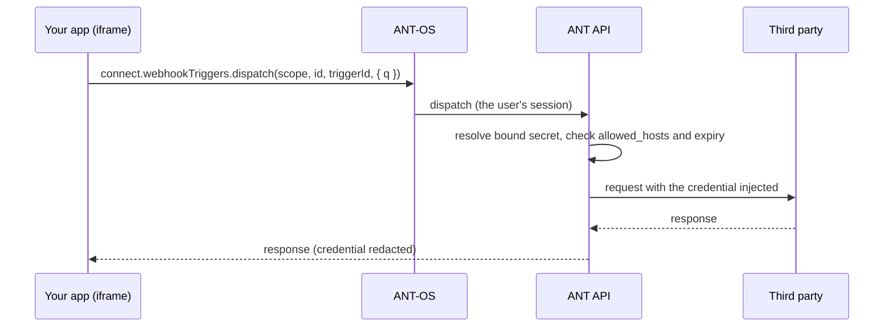

# Vault

> **TL;DR** The Vault stores third-party credentials (API keys, basic auth, OAuth clients, signing
> keys) on the server. Apps **never read** them: a credential is bound to a trigger, and the server
> injects it into that trigger's outbound request. The app only dispatches the trigger.
> **Use when** your app talks to anything outside ANT that needs authentication.

## Concepts

- **Secret.** A named credential owned by a license or a project (`SecretResourceType` is
  `'licenses' | 'projects'`).
  - **The value is write-only.** You set it on create or update. Reads return only `masked_hint`
    (at most the last 4 characters).
  - **Non-secret settings** (token URL, client id, signing scheme) are in `config`.
- **Types** (`SecretType`):

  | Type | Typical use |
  |---|---|
  | `token` | API key sent in a header or query parameter |
  | `bearer` | `Authorization: Bearer …` |
  | `basic_auth` | Username and password |
  | `oauth2_client_credentials` | Service-to-service OAuth. The server fetches and refreshes the token. |
  | `oauth2_authorization_code` | **Per-user** OAuth. Each user grants consent once; tokens are stored per user. |
  | `hmac_signature` | Request signing. You define the signed content, header and algorithm. |

- **Provider** (`SecretProvider`) says where the value lives: `internal` (the default), or an
  external store (`aws_secrets_manager`, `hashicorp_vault`, `azure_key_vault`) that is read at
  dispatch.
- **Egress allowlist.** `allowed_hosts` lists URL prefixes. The secret is only injected into
  requests whose target matches one of them. `null` or an empty list means no restriction.
- **Expiry.** `expires_at` is optional. An expired secret (`is_expired`) is refused at dispatch.
- **Scoping.** A project sees its own secrets plus its license's secrets. The license secrets are
  marked `is_inherited: true` and are read-only in the project; rotate or delete them at the
  license.
- **Grants.** A secret can be shared with roles, with the ability `'use'` or `'manage'`.
- **Binding.** A binding attaches a secret to a trigger with a placement:
  - `SecretPlacement` is `'header' | 'bearer' | 'query' | 'body'`.
  - `name` is the header name, query parameter or JSON path.
  - `format` is an optional template, e.g. `Bearer {{value}}`.
  - A secret can only be bound to triggers in its own scope or its license.
- **Redaction.** If a third party echoes the credential back in its response, the server scrubs
  it before the response reaches the browser.

## Canonical pattern: the flow

Two separate layers mean the app holds nothing:

1. The app's `connect` is a proxy to the OS, so it holds no ANT token.
2. The third-party credential is decrypted per request on the server and never sent to the
   browser.

## Per-user OAuth (`oauth2_authorization_code`)

The first time a user runs a trigger bound to a per-user secret, the dispatch returns
`{ authorization_required: true, authorize_url, secret_id }` instead of data. `useTriggerDispatch`
then:

1. asks the OS to open the provider's consent popup;
2. waits for the result;
3. dispatches again.

The token goes to the server, never to the browser. Your code only has to use the wrapper; see
[triggers.md](triggers.md).

## Rules

- Keep credentials out of the frontend, `app-config.json`, table columns, task fields and dispatch
  bodies. Put them in a Vault secret and bind it to a trigger.
- Set `allowed_hosts` on every secret, so a mis-edited trigger can't send the credential somewhere
  else.
- Set `expires_at` on credentials that rotate. The Vault lists them with the `'expiring'` and
  `'expired'` filters.
- Prefer `oauth2_client_credentials` or `oauth2_authorization_code` over long-lived static tokens
  wherever the provider supports them.
- Let users manage secrets in the OS's Vault app. Your app should at most show **which** secret a
  trigger uses: `listBindings` returns the binding's `secret.name` and `masked_hint`.

## Diagnosing bindings

`webhookTriggerSecrets.testBindings(type, id, triggerId)` is a read-only dry run. It returns one
`BindingTestResult` per binding, with `ok` and a coarse `reason`:

| `reason` | Meaning |
|---|---|
| `missing` | The bound secret no longer exists |
| `expired` | The secret is past `expires_at` |
| `egress_disallowed` | The trigger's target is not in `allowed_hosts` |
| `oauth_failed` | The OAuth token could not be obtained or refreshed |
| `external_failed` | The external provider (AWS, HashiCorp, Azure) could not be reached |
| `undecryptable` | The stored value could not be decrypted |

## More operations

| Call | Purpose |
|---|---|
| `secrets.getSecrets(type, id, filter?)` | List the metadata of secrets in scope (`filter`: `'expiring' \| 'expired' \| 'unused'`) |
| `secrets.createSecret` / `updateSecret` / `deleteSecret` | Manage secrets (the value is write-only) |
| `secrets.getSecretUsages(type, id, secretId)` | Which triggers use this secret, and how |
| `secrets.getSecretGrants` / `grantSecret` / `revokeSecretGrant` | Share with roles (`{ role_id, ability }`) |
| `secrets.getPresets()` | Presets for well-known providers |
| `secrets.scanCredentials` / `convertCredential` | Find credentials stored inline in triggers and move them into the Vault |
| `webhookTriggerSecrets.listBindings` / `bind` / `unbind` / `testBindings` | Trigger ↔ secret bindings |

## OAuth Applications: "Sign in with ANT"

This is the reverse direction: an app or service **hosted outside ANT** lets its users sign in with
their ANT account. Register it under `connect.oauthClients` (`getOAuthClients`,
`createOAuthClient`, `updateOAuthClient`, `rotateOAuthClientSecret`, `deleteOAuthClient`), or in
the Vault app.

- **The client is confidential.** `client_secret` is shown once, on create or rotate. Only a
  server can keep it secret, so the code → token exchange must happen on your backend, never in
  the browser.
- **Use PKCE** at the authorize step as well.
- **Redirect URIs must match exactly.** Plain `http` is only accepted for `localhost` during
  development; everything else must be `https`.
- **Request only the scopes you need** (e.g. `profile`, `users:read`).
- **Audience.** `is_global: false` limits sign-in to users of the owning license.

An externally hosted app that already has its own token can also call the API directly; see
[../calling-the-api.md](../calling-the-api.md).

## Don't

- Don't store a third-party secret in a dynamic table column "just for this app". Anyone with read
  access to the table can read it.
- Don't mint provider tokens in the browser, e.g. by posting a client secret to a token endpoint
  from the app. Use an `oauth2_client_credentials` secret and let the trigger obtain the token.
- Don't render raw third-party responses on the assumption that redaction made them safe.
  Redaction is a safety net, not a design.

## See also

[triggers.md](triggers.md) · [permissions.md](permissions.md) · [../scenarios.md](../scenarios.md) ·
[../pitfalls.md](../pitfalls.md)
