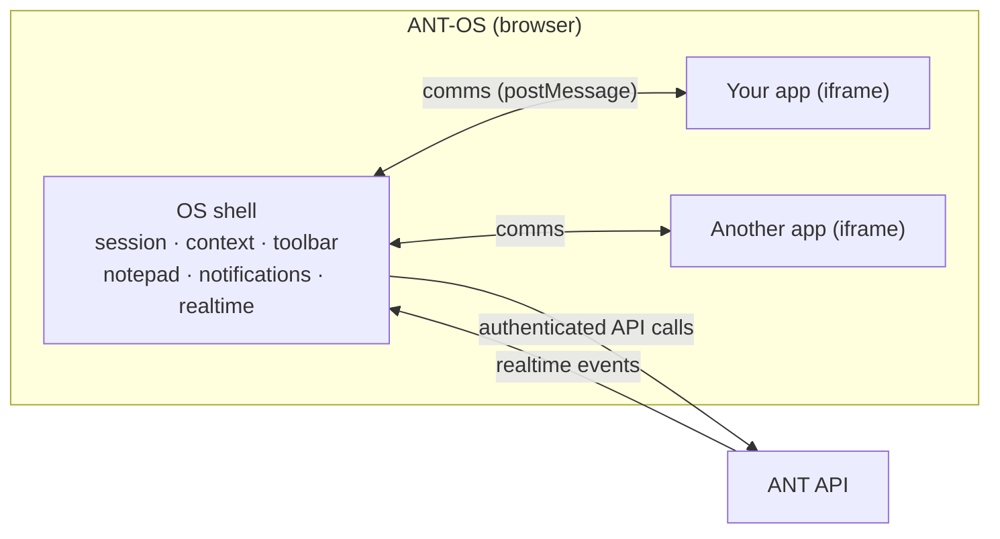
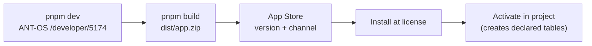

# How ANT works

> **TL;DR** ANT-OS is a shell that hosts many small apps in iframes. The shell owns the user
> session, the current license/project/task, the chrome (title bar, notifications, side
> panel) and the realtime connection. Your app reads that context and asks the shell to act.
> **Use when** you are new to ANT, or you need the mental model behind the other docs.

## The shell and its apps

- Every app is a normal web app (this template: Vue 3 + Vuetify) loaded in an **iframe** by the
  OS. One screen can show two apps side by side (split screen).
- The app talks to the OS through **comms**, a typed channel over `postMessage`
  (`useCommsClient()` from `@antcde/vue-utils`). See [shell-integration.md](shell-integration.md).
- The OS holds the user's session. By default the app holds **no token**: every
  `comms.connect.*` call is forwarded to the OS, which makes the request.
  See [calling-the-api.md](calling-the-api.md).
- The OS holds the only realtime (websocket) connection and relays events to apps as
  **signals**. See [signals-and-realtime.md](signals-and-realtime.md).

## License → project → task

Everything in ANT lives inside a hierarchy, and the OS tracks the user's current position in it:

| Level | What it is | In `comms.context` |
| --- | --- | --- |
| **License** | An organisation's account: users, roles, apps, license-wide data | `license` |
| **Project** | A unit of work within a license: its own members, files, tables, tasks | `project` (may be `null`) |
| **Task** | A unit of work in a project or license; tasks nest into workflows | `selectedTask`, `notepadTask` |
| **SBS** | A location/breakdown code inside a project | `sbs` |

- A change at one level **clears everything below it**: switching license clears the
  project, switching project clears the task.
- The app is **not reloaded** when the user switches project. Watch the context and reset
  your state. Every example in `src/examples/` does this.
- Some apps work at license level, some need a project. Show a clear notice when what you need
  isn't selected (`src/examples/_shared/ScopeNotice.vue`).
- An archived project stays selectable but is **read-only**: `context.projectReadOnly` is
  `true` and the API refuses writes. Disable write controls up front.

## Resources

The platform resources an app can use. Each has a doc under [capabilities/](capabilities/).

| Resource | What for | Doc |
| --- | --- | --- |
| Dynamic tables | Structured data; an app can declare its own tables | [tables.md](capabilities/tables.md) |
| DMS (documents) | Files and folders per project or license | [files-dms.md](capabilities/files-dms.md) |
| Tasks & workflows | Work items, templates, flows | [tasks-and-workflows.md](capabilities/tasks-and-workflows.md) |
| Triggers | Server-side actions started over HTTP or by events | [triggers.md](capabilities/triggers.md) |
| Vault | Credentials for third-party systems, used by triggers | [vault.md](capabilities/vault.md) |
| Scripts | Server-side Python, run by triggers or tasks | [scripts.md](capabilities/scripts.md) |
| Labels & SBS | Cross-cutting tagging and location codes | [labels-sbs.md](capabilities/labels-sbs.md) |
| Types & templates | Custom fields for tasks/projects; project templates | [types-and-templates.md](capabilities/types-and-templates.md) |
| Permissions | Roles and permissions at license and project level | [permissions.md](capabilities/permissions.md) |

## Permissions

- Permissions exist at license level and at project level, as `<resource>.<action>`
  (for example `dms.upload`). Admins at either level bypass the checks for that level.
- The current user's permissions arrive **with the context**. Check them with
  `usePermissions(comms.context)`; don't fetch them.
- The API enforces permissions. UI gating is for user experience, not security.

See [capabilities/permissions.md](capabilities/permissions.md).

## App lifecycle

1. **Develop.** Run `pnpm dev` and open ANT-OS at `/developer/5174`. The OS loads your
   local dev server as if it were an installed app. See [app-anatomy.md](app-anatomy.md).
2. **Build.** `pnpm build` produces `dist/app.zip` containing the app,
   `app-config.json`, `README.md` and `CHANGELOG.md`.
3. **Publish.** Upload a version to the App Store. You need an ANT license of your own;
   third parties get their own license to publish apps. See [publishing.md](publishing.md).
4. **Install and activate.** A license installs the app, then activates it per project.
   Activation creates the tables declared in `app-config.json`. See [app-manifest.md](app-manifest.md).

## Where to go next

- Building your first feature: [app-anatomy.md](app-anatomy.md), then
  [calling-the-api.md](calling-the-api.md).
- Before you ship: [pitfalls.md](pitfalls.md).
