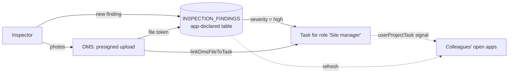
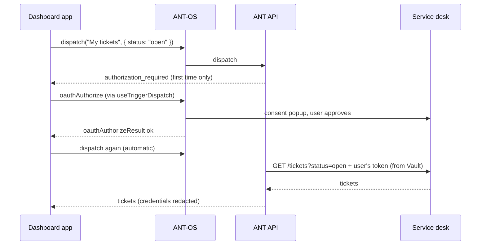

# Scenarios: combining capabilities

> **TL;DR** Three worked examples of how ANT's building blocks fit together into a real app.
> **Use when** you are designing an app and want to see which capability carries which part of
> the job.

These scenarios are **illustrative**. They were invented to show patterns and are not
descriptions of existing apps. Code fragments are deliberately short. Each links to the doc and
the template example where the full pattern lives.

---

## A. Site inspection app

**Goal.** An inspector walks a site, records findings and attaches photos. Each serious finding
creates a follow-up task for whoever holds the "Site manager" role. Colleagues see new findings
appear without reloading.



| Capability | Why |
|---|---|
| **Dynamic table** declared in `app-config.json` | The findings are the app's own data. Declaring the table means it exists in every project the app is activated in, with no setup. |
| **DMS** | Photos belong in document management, where they get permissions, previews, labels and search for free. The finding stores the file **token**. |
| **Tasks** | Follow-up work is a task, so it shows up in everyone's notepad, task lists and workflows. Your app doesn't need its own inbox. |
| **Signals** | New tasks arrive through `userProjectTask`, so other users' apps refresh live. |
| **Permissions** | Only users with create rights on the table see the "New finding" button. Archived projects are read-only. |

```jsonc
// app-config.json (excerpt)
{ "tables": [{ "name": "INSPECTION_FINDINGS", "context": "project", "columns": [
  { "name": "title", "type": "text", "required": true },
  { "name": "severity", "type": "dropdown", "options_value": ["low", "medium", "high"] },
  { "name": "photo_token", "type": "text" },
  { "name": "sbs", "type": "sbscode" }
] }] }
```

```ts
// 1. Upload the photo. Bytes go straight to storage; see files-dms.md and src/examples/files/
const [photo] = await uploadToProjectRoot([file])   // getUploadUrls → PUT → uploadFilesFinish

// 2. Store the finding (tableId comes back from queryTables)
await createRecord.execute(tableId, {
  record: { title, severity, photo_token: photo.token, sbs: context.value.sbs?.code ?? null },
})

// 3. Serious finding → follow-up task for a role, with the photo attached
if (severity === 'high') {
  const task = await importTask.execute({
    title: `Follow up: ${title}`, project: projectId.value, license: licenseId.value,
    role_ids: [siteManagerRoleId], priority: 'high',
  })
  if (task) {
    await linkFile.execute(task.id, photo.id)
    signal({ task: { id: task.id, action: 'created', data: task } })
  }
}
```

**Pitfalls**
- Don't upload photos into a `document` column as base64 when they should be shared files. Use
  DMS and store the token. A `document` column suits small per-record attachments.
- Look up the role id with `rbacRoles.fetchRoles('projects', projectId)` and match it by name only
  once. Don't hard-code ids.
- Reset all state when `projectId` changes. The app is not reloaded when the user switches project.
- Check `projectReadOnly` before showing the create form.

See [capabilities/tables.md](capabilities/tables.md),
[capabilities/files-dms.md](capabilities/files-dms.md),
[capabilities/tasks-and-workflows.md](capabilities/tasks-and-workflows.md) and
[capabilities/permissions.md](capabilities/permissions.md).

---

## B. Third-party sync without holding a credential

**Goal.** A dashboard shows each user's open tickets from an external service desk. Signing in to
that service desk is per user (OAuth). The app must never hold an API key or a user token.
Optionally, the tickets are copied into an ANT table every night.



| Capability | Why |
|---|---|
| **Vault** secret, type `oauth2_authorization_code`, with `allowed_hosts` set to the service desk | Per-user tokens are stored on the server. The secret can't be injected into requests to any other host. |
| **Trigger** with `ExternalHttpRequestEvent`, bound to that secret | The request is configuration, not code. The app sends only the question (`{ status }`), which is merged over the stored request. |
| `useTriggerDispatch` | Handles the consent popup and the single retry. |
| Optional **trigger** `TransformWithScriptEvent` plus a **script** | Reshapes the raw response into rows. A system-event (`when`) trigger can write them to a table for reporting. |

```ts
const dispatchApi = useApi(connect.webhookTriggers.dispatch, null, { throwError: true })
const { dispatch } = useTriggerDispatch(comms)

const tickets = await dispatch(() =>
  dispatchApi.execute(scope.value.type, scope.value.id, myTicketsTrigger.id, { status: 'open' }))
```

**Pitfalls**
- Don't put the provider's client secret in a table or in the app to "just get a token". Create an
  OAuth secret in the Vault.
- Leave out `throwError: true` and a refused dispatch looks like "no tickets".
- Errors arrive as a message only, so show it as it is. Use `testBindings` (a dry run) to explain
  configuration problems such as `expired` or `egress_disallowed`.
- Look up the trigger by name in the current scope. Ids differ per license.

See [capabilities/triggers.md](capabilities/triggers.md),
[capabilities/vault.md](capabilities/vault.md) and [capabilities/scripts.md](capabilities/scripts.md).

---

## C. Cross-app collaboration in split screen

**Goal.** A *map* app lists locations. Picking one opens a *details* app next to it, which follows
the selection. The details for a location can be bookmarked and shared as a link.

```mermaid
sequenceDiagram
  participant Map as Map app (pane 0)
  participant OS as ANT-OS
  participant Det as Details app (pane 1)
  Map->>OS: openSplit { app: { id: detailsAppId }, pane: 1 }
  OS->>Det: loads; initialRouteQuery.locationId (deep link)
  Map->>OS: topic "location-selected" { locationId }
  OS->>Det: topic "location-selected" (same browser tab)
  Det->>OS: route { query: { locationId } }  (URL becomes shareable)
```

| Capability | Why |
|---|---|
| `openSplit` signal | The OS lays out the panes. Apps never embed each other. |
| **Topic** declared in both apps' `signals.topics` (`direction: ["send"]` in the map app, `["receive"]` in the details app) | Loose coupling: the map doesn't need to know who listens. The declaration documents the contract and its payload schema in the App Store. |
| `capabilities.queryParams.locationId` plus a `route` signal and `initialRouteQuery` | Deep links: the details app can be opened straight on a location, and the OS URL always reflects what is shown. |
| `select` signal | If picking a location should also change the OS's selected SBS, the app asks the OS (`select: { sbs: code }`) instead of keeping its own idea of the selection. |

```ts
// Map app
signal({ openSplit: { app: { id: detailsAppId }, pane: 1, layout: 'v' } })
signal({ topic: { name: 'location-selected', scope: 'project', data: { locationId } } })

// Details app
const current = ref(context.value.initialRouteQuery?.locationId ?? null)
const stop = signal.receive((s) => {
  if (s.topic?.name === 'location-selected')
    current.value = s.topic.data.locationId
})
onScopeDispose(stop)
watch(current, id => signal({ route: { query: { locationId: id } } }))
```

**How topic delivery works** (current behaviour, so design for it):
- A topic is delivered to every **other** app subscribed to it. The sender never receives its own
  message.
- Within one browser tab, the OS hands the message to the other apps in that tab, whether or not
  they ever published.
- Across browser tabs and other users, the OS joins a tab to the topic's shared channel only once
  that tab has **published** on the topic. A tab that only ever receives therefore gets messages
  from apps in the same tab, but not from other tabs or other users. If you need cross-user
  delivery, have the receiving app publish once (e.g. a small "ready" message) when it mounts.
- A topic is scoped to the current project (`scope: 'project'`) or license (`scope: 'license'`).

**Pitfalls**
- Prefer `app: { id }` over `app: { title }` in `openSplit`, because titles can change and are
  translated.
- Read `initialRouteQuery` once, on start. Signals sent before the handshake are lost, so don't
  rely on an early `route` signal.
- Keep topic payloads small and validate them. They come from other apps.

See [signals-and-realtime.md](signals-and-realtime.md), [app-manifest.md](app-manifest.md) and
[shell-integration.md](shell-integration.md).
